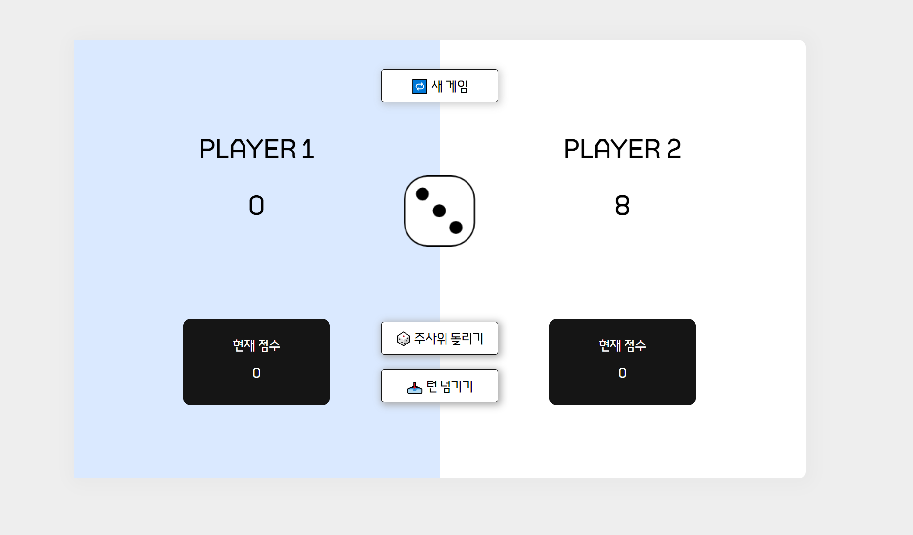

# 주사위게임

### 게임 방법

1. 번갈아 가면서 주사위를 던지는 게임
2. 누적 점수 50점을 만들면 이김.
3. 주사위를 던졌을 때 숫자가 나오면 1~2는 본인 현재 점수 초기화 후 턴 변경.
4. 3~6은 현재 점수에 나온 주사위 숫자를 더한다.
5. 이후에 홀드하고 현재 점수를 누적 점수에 더할 지, 계속 던질 지 선택한다.

### 사용스택

- HTML
- CSS
- JavaScript

### 게임영상

